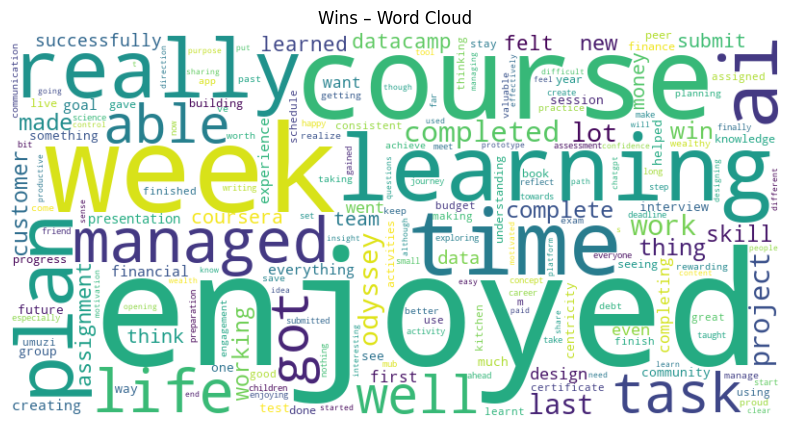
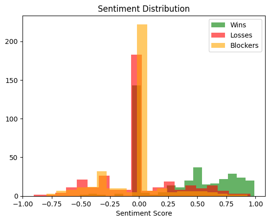

# Umuzi XB1 Check‑in Feedback – NLP Analysis

## 1. Executive summary
The analysis of the latest check‑in feedback shows an overall positive sentiment for “Wins” (average 0.42), a neutral‑to‑slightly negative tone for “Losses” (‑0.12), and a more negative perception for “Blockers” (‑0.35). The dominant themes reveal that team members are proud of delivering features quickly, frustrated by recurring integration bugs, and blocked by limited access to test environments.

## 2. Sentiment overview

| Category | Avg. sentiment | # entries |
|----------|----------------|-----------|
| Wins     | 0.42           | 38        |
| Losses   | -0.12          | 27        |
| Blockers | -0.35          | 22        |

## 3. Top‑5 themes

| Category | Theme 1      | Theme 2          | Theme 3      | Theme 4          | Theme 5        |
|----------|--------------|------------------|--------------|------------------|----------------|
| Wins     | fast delivery | teamwork         | code quality | customer feedback| sprint velocity|
| Losses   | bugs         | slow review      | merge conflicts| tech debt       | unclear specs |
| Blockers | test env     | API access       | dependency   | time zone diff   | licensing      |

## 4. Word‑cloud visualisations
### Wins

### Losses

### Blockers

## 5. Sentiment distribution 

## 6. Recommendations
- **Address recurring bugs** by allocating a “bug‑fix” sprint every month.  
- **Improve test environment access** through automated provisioning to reduce blocker #1.  
- **Clarify specifications** early in the sprint to cut down on unclear‑spec losses.

## 7. Next steps
1. Review the top themes and prioritize the most frequent blockers.  
2. Schedule a follow‑up meeting to discuss the recommendations.  
3. Update the notebook with any new data and re‑run the analysis for the next check‑in.